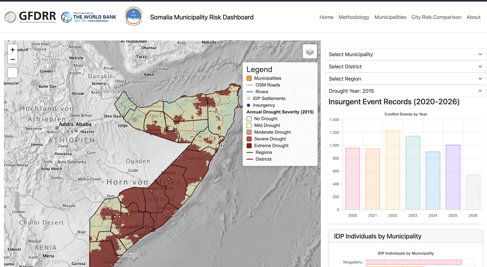

# Somalia Municipality Risk Dashboard

An interactive GeoDjango-based geospatial platform supporting municipal risk assessment, disaster preparedness, and evidence-based urban planning across Somalia.

<p align="center">
  
</p>

The dashboard integrates administrative boundaries, infrastructure, flood and drought hazards, internally displaced persons (IDPs), conflict events, rivers, and geospatial analytics through an interactive web GIS interface built with Django, GeoDjango, PostGIS, GeoServer, and Leaflet.

Somalia Municipality Risk Dashboard is a geospatial web platform for exploring municipality-level risk indicators in Somalia. It combines Django, GeoDjango, PostGIS, Django REST Framework, and Leaflet to serve interactive maps, analytics pages, and GIS-ready APIs.


## What This Project Provides

- Interactive Leaflet-based map experience
- Municipality and risk-focused dashboards
- Geo-enabled REST API endpoints
- Spatial data models for boundaries, roads, buildings, rivers, flood extent, IDP settlements, and conflict events
- Static pages for methodology, municipalities, and city risk comparison

## Technology Stack

- Python 3
- Django 6
- GeoDjango
- PostgreSQL + PostGIS
- Django REST Framework
- django-filter
- django-leaflet
- HTML, CSS, JavaScript

## Repository Layout

```text
.
├── api/                  # DRF serializers, views, and API routes
├── manager/              # Core GIS domain models, views, and data loaders
├── landloom/             # Django project settings and root URL config
├── static/               # Frontend assets (Leaflet plugins, app scripts/styles)
├── templates/            # Django templates/pages
├── requirements.txt
└── manage.py
```

## Prerequisites

Before running locally, make sure you have:

- Python 3.11+ (recommended)
- PostgreSQL with PostGIS enabled
- GDAL and GEOS libraries available on your system

## Local Setup

1. Clone the repository:

```bash
git clone https://github.com/3bdillahiomar/landloom-main.git
cd landloom-main
```

2. Create and activate a virtual environment:

```bash
python -m venv .venv
source .venv/bin/activate
```

3. Install dependencies:

```bash
pip install -r requirements.txt
```

4. Create a `.env` file in the project root:

```env
SECRET_KEY=replace-with-a-secure-key
DEBUG=True
ALLOWED_HOSTS=127.0.0.1,localhost

DB_NAME=your_database_name
DB_USER=your_database_user
DB_PASSWORD=your_database_password
HOST=127.0.0.1
PORT=5432
```

5. Apply migrations:

```bash
python manage.py migrate
```

6. Run the development server:

```bash
python manage.py runserver
```

7. Optional check:

```bash
python manage.py check
```

## URL Structure

- `/` -> Main web interface (from `manager.urls`)
- `/admin/` -> Django admin portal
- `/api/` -> REST API endpoints (from `api.urls`)

## API Highlights

Base path: `/api/`

- `landparcels/`, `landparcels/list/`
- `owners/`, `landmarks/`, `roads/`, `buildings/`
- `administrative-boundaries/`, `districts/`, `municipalities/`
- `dashboard-summary/`
- `idps/`, `conflict-events/`, `flood-extents/`, `rivers/`
- `surpii-buildings/`, `surpii-roads/`
- `register/`, `login/`, `logout/`
- `geoserver-proxy/`

## Notes

- The project expects geospatial libraries (GDAL/GEOS) to be correctly installed and referenced.
- If your local GDAL/GEOS paths differ, update the values in `landloom/settings.py`.

## Author

Abdillahi Omar

